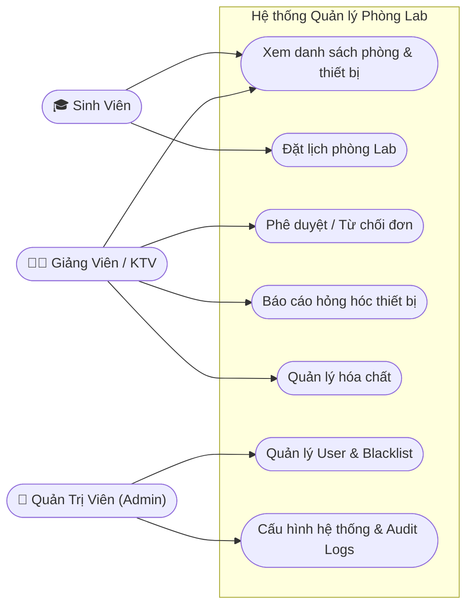
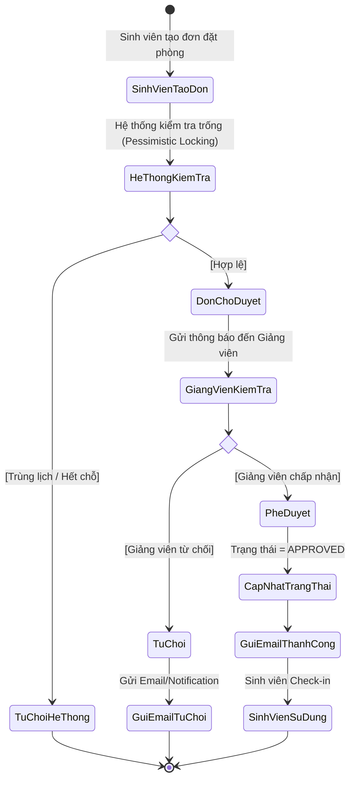

# Tài Liệu Kỹ Thuật & Hướng Dẫn Sử Dụng (Lab Management System)

## 1. Sơ đồ UML (UML Diagrams)

### 1.1 Sơ đồ Use Case Tổng quan
Sơ đồ mô tả các tính năng chính phân quyền theo các nhóm người dùng trong hệ thống.

### 1.2 Sơ đồ Hoạt động (Activity Diagram): Luồng đặt phòng và phê duyệt
Sơ đồ mô tả nghiệp vụ lõi (Core flow) của hệ thống khi sinh viên đặt phòng.

## 2. Hướng dẫn Sử dụng Chi tiết

### 2.1 Dành cho Sinh Viên (Student)
- **Đăng nhập:** Truy cập hệ thống và đăng nhập bằng tài khoản email trường cấp (`@student.edu.vn`).
- **Tra cứu:** Sử dụng menu **"Danh sách Lab"** để xem thông tin phòng trống, thiết bị khả dụng trong phòng.
- **Đặt lịch phòng Lab:**
  1. Bấm vào phòng/thiết bị muốn mượn, chọn khung giờ trống.
  2. Điền form yêu cầu: Mục đích sử dụng, số lượng người tham gia.
  3. Bấm **"Gửi yêu cầu"**.
- **Theo dõi đơn đặt:** Xem tại tab **"Lịch sử đặt phòng"**. Đơn sẽ có các trạng thái `PENDING` (Chờ duyệt), `APPROVED` (Đã duyệt), `REJECTED` (Bị từ chối). Hệ thống sẽ có thông báo (chuông/email) khi trạng thái thay đổi.

### 2.2 Dành cho Giảng viên / Kỹ thuật viên (Lecturer / Technician)
- **Phê duyệt đơn đặt phòng:**
  1. Vào menu **"Quản lý Yêu cầu"**.
  2. Xem chi tiết các đơn đang `PENDING`.
  3. Chọn **"Phê duyệt"** hoặc **"Từ chối"** (Bắt buộc nhập lý do nếu từ chối). *Lưu ý: Nếu không thao tác sau 24h, hệ thống Cron job sẽ tự động hủy đơn.*
- **Quản lý Thiết bị & Hóa chất:**
  - **Báo cáo hỏng hóc:** Vào phần "Thiết bị", chọn thiết bị lỗi, cập nhật trạng thái thành `MAINTENANCE` (Đang bảo trì) hoặc `BROKEN` (Hỏng). Hệ thống sẽ lập tức chặn sinh viên mượn thiết bị này.
  - **Hóa chất:** Cập nhật số lượng nhập/xuất. Theo dõi cảnh báo tồn kho và cảnh báo hóa chất sắp hết hạn trên màn hình Dashboard.

### 2.3 Dành cho Quản trị viên (Admin)
- **Quản lý Người dùng (Blacklist):** Truy cập **"Quản lý User"**. Quản trị viên có quyền `Ban` (Khóa) hoặc `Blacklist` các tài khoản vi phạm nội quy (VD: Sinh viên đã đặt phòng nhưng không đến - No show nhiều lần).
- **Cấu hình tham số hệ thống:** Vào mục **"Cài đặt"**, điều chỉnh thời gian tối đa để duyệt đơn, tham số Rate Limit chặn spam, thời hạn làm mới Token.
- **Kiểm soát tính minh bạch (Audit Logs):** Truy cập **"Nhật ký Hệ thống"** để kiểm tra mọi vết truy cập, thay đổi dữ liệu của toàn bộ người dùng nhằm mục đích truy vết khi xảy ra sự cố.
